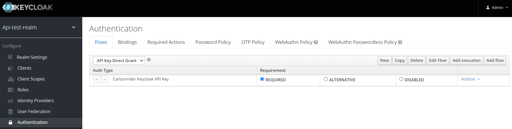
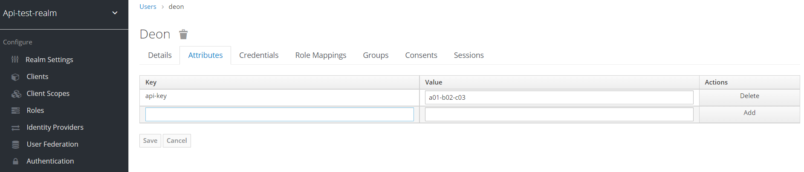
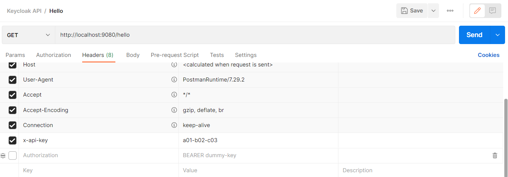

# keycloak-api-key-module

Keycloak doesn't natively support API key generation for Users. This project attempts to provide the feature of creating API key for users. The feature can be used with existing Spring boot project which has Bearer authentication enabled.

## Module structure

The module has been divided into 3 main directories

- **keycloak-api-key-core**: Keycloak plugin to enable API key generation for user and validation.
- **example-spring-keycloak**: A sample spring boot application demonstrating how to use the adapter
- **keycloak-spring-api-key-adapter**: An adapter to be included in Spring boot project. It reads API key (x-api-key) header from web request and passes that to Keycloak for validation.

## How to configure?

To enable API key feature in a spring boot project refer to following steps.

### Build and Deploy Keycloak plugin

- Execute `mvn package` command at the root directory. This will build all the modules and create deployable JAR files inside *keycloak-api-key-core* and *keycloak-spring-api-key-adapter*
- Copy the JAR file from *keycloak-api-key-core/target/keycloak-api-key-core.jar* to */opt/jboss/keycloak/standalone/deployments/* directory to deploy the plugin (You will find a sample Docker file inside *keycloak-api-key-core*)

### Enable API Key adapter in Spring boot project

To enable authentication via API key, copy the jar file from *keycloak-spring-api-key-adapter/target/keycloak-spring-api-key-adapter.jar* to your project lib directory.

(The project artifacts are  not yet available on Maven central repository and hence either jar or source code must be copied to project directory.)

Refer to *com.carbonrider.keycloak.api.example.configuration.ExampleConfiguration.java* in **example-spring-keycloak** project to configure the adapter.

### Keycloak configuration

You must have a client configured in Keycloak with **Direct grants access**.

- Copy an existing authentication flow (**Direct Grant**) and add a new execution (**Carbonrider Keycloak API Key**).

- Remove existing executions (Username validation, Password, Direct Grant - Conditional OTP). The new flow must have only one execution (**Carbonrider Keycloak API Key**). 

- Go to **Bindings** tab and for *Direct Grant Flow* select the authentication flow created in prior step.

## How to test?

You can test the configuration by

- By setting a custom attribute (**api-key**) for any user and initialize it with a value.

- Invoke a sample API from Postman with a request header as **x-api-key** with the value configured as above. You will find a sample Hello API in the **example-spring-keycloak** project.

## How to enable API Key generation
An API key can be genreated using built-in rest API available with the project. 
- Create a new role **api-key-generator** role at realm level.
- Assign the role to a user (service account). This user will be used from your application to invoke Keycloak provided API.
- Execute post request */api-key* with *userid* as query parameter (e.g. /api-key?userid=jim). Note that the invoking user must have **api-key-generator** role at realm level.